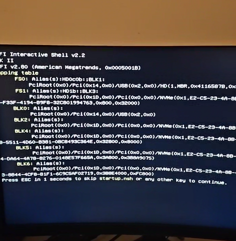

# HP Permanent Spoof

### <mark style="color:yellow;background-color:yellow;">FOLLOW THESE STEPS FIRST BEFORE TUTORIAL VIDEO</mark>


This process of '**unlocking**' the motherboard has to be done **ONCE**. You do not have to redo it anymore. Your motherboard will be permanently unlocked to be able to spoof.\
\
🌟 **Easiness**: <mark style="color:green;">**8/10 VERY EASY**</mark>**&#x20;|** **5 Minutes Average Time.** 🕒


1. Plug in a USB to ur computer (Must be 32GB or less, not more)
2. **Right-click** on the **USB** drive in Windows Explorer and click on '**Format'**.
3. Change File System to '**FAT32**', then click on **start** and **wait**.
4. Select USB Letter in the Loader, and run '**HP** **Unlock**'! <mark style="background-color:red;">**No Files will be shown inside ur USB!!**</mark>
5. After success, Hold **SHIFT**, click **Restart, and keep holding SHIFT!**

<figure><figcaption></figcaption></figure>

7. Select '**Use a device'** and select the USB <mark style="background-color:blue;">(Known as "Flash Drive")</mark>

<figure><figcaption></figcaption></figure>

7. Just **WAIT** now, and u will see something that **looks like this picture below:**

<figure><figcaption></figcaption></figure>

9. Now, after this **WAIT**, it will ask "**Manufacturer mode to unlock mode": &#x20;**<mark style="color:green;background-color:green;">**CLICK YES!**</mark>

<figure><figcaption></figcaption></figure>

9. Now it will boot into Windows again, and the USB can be removed.\
   <mark style="background-color:yellow;">**In case Windows does not boot, please remove the USB, and wait.**</mark>


**Make sure there is no BIOS Password enabled.** 🔐 This will cause the serials not to change on HP. If "Manufacturer mode" doesn't show up, flash ur BIOS to an older version.


***

## AFTER THE UNLOCK, FOLLOW THE TUTORIAL VIDEO:

### <mark style="color:red;background-color:red;">**MAKE SURE TO REMOVE ANY 'USB' ON YOUR PC CONNECTED!**</mark>

* <mark style="background-color:blue;">**Watch:**</mark> [**VERSE TUTORIAL VIDEO HERE**](https://bit.ly/instructions-video)
* _**A like, subscribe, & comment would be..**_ _<mark style="color:yellow;">**verse-tacular!**</mark> ❤️_

### <mark style="color:purple;">**WATCH THIS VIDEO AFTER:**</mark>**&#x20;(NETWORK UNFLAGGING)**



***

### <mark style="background-color:green;">MAKE SURE TO CHECK:</mark>



_SEND US YOUR **OLD SERIAL**S BY A SCREENSHOT OF THE **'DEVICE'** TAB WITHIN VERSE_



_CHECK IF **ALL** SERIALS CHANGED, NO EXCEPTIONS._



_RUN "MAC SPOOF" FOR A PERMANENT MAC SPOOF._



_CHECK THE MAC-CHECKER, IF ALL MACS CHANGED._




**TIP: Mac-address not changed?** Use our "WIFI MAC SPOOFER" in the **miscellaneous** tab.\
<mark style="color:red;background-color:red;">Still not changed?</mark> **`1.`** [Disable in BIOS](https://verse-solutions.gitbook.io/verse-permanent/setup-instructions/bios-configurations#turn-off-wifi-and-bluetooth-required) **`2.`** **Or follow:** [https://streamable.com/p2xfby](https://streamable.com/p2xfby)


***


[serials-not-changing.md](../../fixes-issues/serials-not-changing.md)

