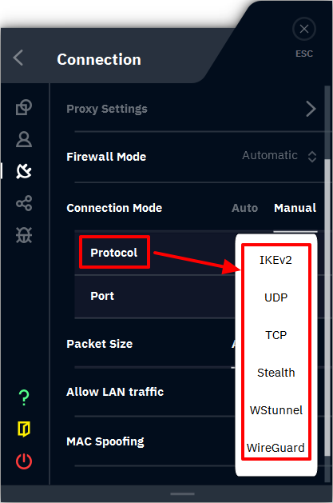

# 🌐 Usage of VPN

**USE A VPN FOR ONE WEEK ON EAC/BE **<mark style="color:red;">**\[**</mark>** **<mark style="color:red;background-color:red;">**REQUIRED**</mark>** **<mark style="color:red;">**]**</mark>

> <mark style="color:blue;">**WINDSCRIBE - 0 Packet loss &**</mark> [<mark style="color:blue;">**Free 10GB Trial**</mark>](https://windscribe.com/features/use-for-free/)

> <mark style="color:green;">**IPVANISH - Most locations & Free with Verse VIP**</mark>

> [<mark style="color:purple;">**Mysteriumdark**</mark>](https://www.mysteriumdark.com/) <mark style="color:purple;">**-**</mark>** Known to work on Rust. (Residential, **<mark style="color:red;">**ONLY**</mark>** recommended for Rust)**

<strong>WHY IS USING A VPN REQUIRED WITH VERSE?</strong>

Using a VPN is essential for Verse to ensure you don't risk a network ban, as we've seen increasing issues with this. It's crucial to make sure everything works smoothly for you. Just use a VPN for one week, and after that, you can safely turn it off without worry. While we could explain the technicalities, trust us on this - **you're in good hands with Vers**e.\
\
<mark style="color:yellow;">**YES, YOU CAN "MAGICALLY" TURN OFF YOUR VPN AFTER A WEEK.**</mark>

***

### MAKE SURE TO USE <mark style="color:blue;">WINDSCRIBE</mark> VPN ON 'STEALTH MODE'

Also, make sure to have the Firewall on "Automatic" and <mark style="color:green;">**enabled.**</mark>

<figure><figcaption></figcaption></figure>

***

#### **YOU CAN ORDER WINDSCRIBE/IPVANISH AT VERSE CHEAPLY 1+ YEAR SUBS:**

* **〖🎭〗eccounts:** [**CLICK ME TO BUY A VERY CHEAP VPN**<mark style="color:blue;">**!**</mark> ](https://discord.com/channels/1267985769394339920/1267986898761154601)**(Discord link)**


**TIP: **<mark style="color:red;">**DO NOT USE NORDVPN/PROTONVPN.**</mark>** THESE WILL NOT WORK.** \
**YOU NEED A VPN WITH "DOUBLE-HOP" ENCRYPTION. (THE ONES WE LISTED/SELL**_**)**_


***
