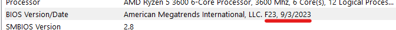

# Flashing BIOS  (VAL)

### BIOS FLASH SHOULD BE DONE BEFORE REINSTALLING WINDOWS

**MAKE SURE TO UNINSTALL **<mark style="color:red;">**VANGUARD**</mark>


🌟 **Easiness**: <mark style="color:yellow;">**7/10 Doable, not difficult**</mark>** | Takes max 15 Minutes.**


<strong>BIOS VERSION SUGGESTION:</strong>

We recommend flashing your motherboard to an older BIOS version. Based on our professional experience, this process is completely safe, and we've observed a higher success rate with spoofing when using the previous BIOS version.

***

> **ASUS:** [**https://youtu.be/Em7SRaG3L\_0?si=pzdHZjNo\_Fu0bAI**](https://youtu.be/Em7SRaG3L\_0?si=pzdHZjNo\_Fu0bAI2)

> **ASROCK:** [**https://youtu.be/dUCWRqOdLUw?si=1kA5ER1vzcgV3Npg**](https://youtu.be/dUCWRqOdLUw?si=1kA5ER1vzcgV3Npg)

> **GIGABYTE:** [**https://youtu.be/DIIde3s02kM?si=uojxszXk1YHz79sQ**](https://youtu.be/DIIde3s02kM?si=uojxszXk1YHz79sQ)

> **LENOVO:** [**https://youtu.be/AwOax1uWgYc?si=p0GFrReez2Ttk0UV**](https://youtu.be/AwOax1uWgYc?si=p0GFrReez2Ttk0UV)

> **MSI:** [**https://youtu.be/sKMub20CUNI?si=EBQyE2A7o3VdToSG**](https://youtu.be/sKMub20CUNI?si=EBQyE2A7o3VdToSG)

***

\
**HOW DO YOU CHECK IF YOUR FLASH WAS **<mark style="color:green;">**SUCCESSFUL?**</mark>

<figure><figcaption>
<em><mark style="color:green;"><strong>THE VERSION &#x26; DATE SHOULD BE CHANGED</strong></mark><strong> WHICH CAN BE FOUND AT YOUR SYSTEM INFORMATION</strong></em>                             
</figcaption></figure>

***


NOW CONTINUE WITH [normal-reinstallation.md](normal-reinstallation.md "mention")| [raid-reinstallation.md](raid-reinstallation.md "mention")

