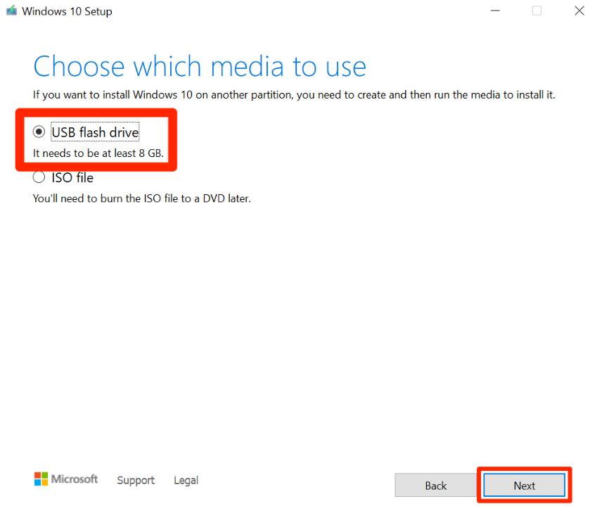
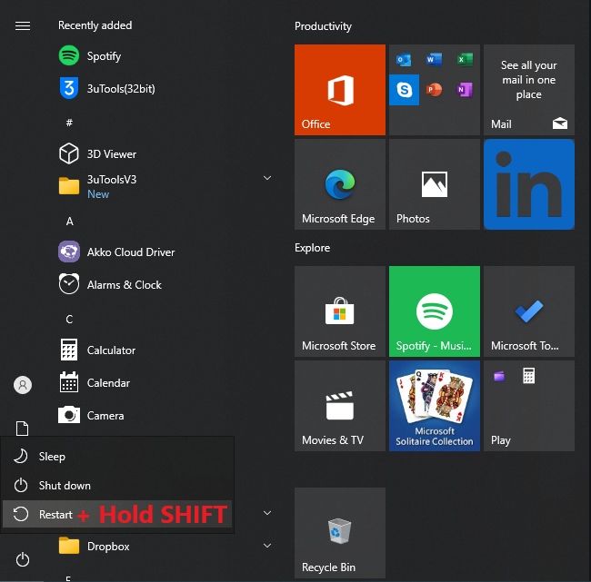
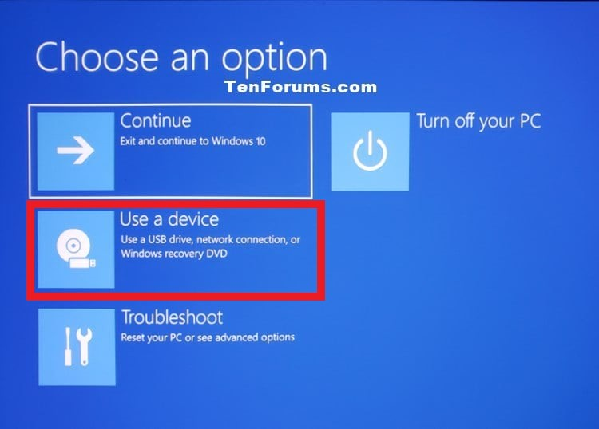
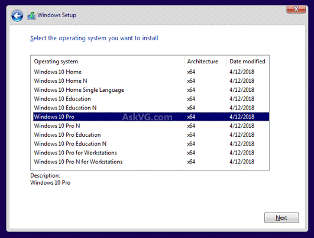
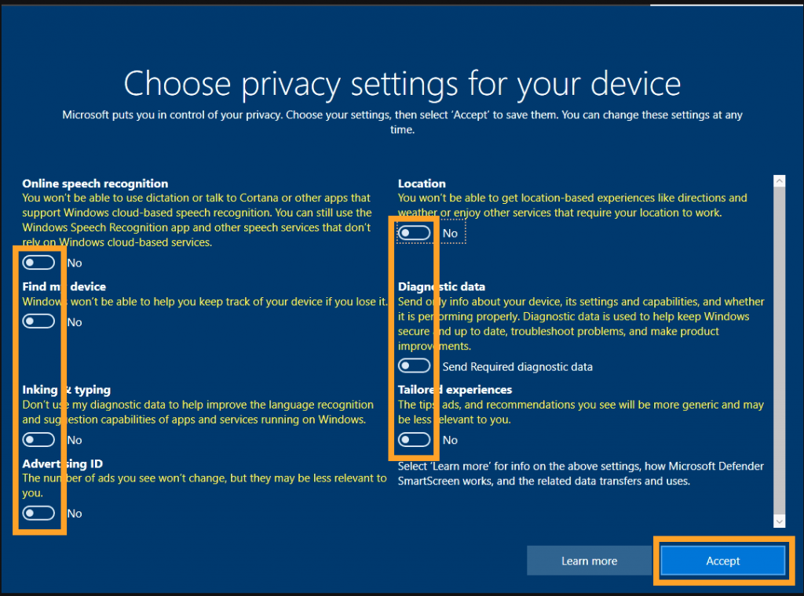

# Normal reinstallation


<mark style="background-color:orange;">**Reinstalling Windows with a USB is HIGHLY recommended. This is to ensure the disk bans are gone.**</mark>\
\
🌟 **Easiness**: <mark style="color:green;">**8/10 VERY EASY**</mark>** | Takes max 15 Minutes.**\
\
<mark style="color:yellow;">**Am I Disk Banned? Here’s How to Tell:**</mark> If many spoofers haven’t worked for you and you've faced multiple bans on the same PC, it's likely to be disk banned. In this case, we recommend reinstalling using a USB.


<mark style="color:red;"><strong>I DONT HAVE A USB</strong></mark><strong> // IT LOOKS HARD!</strong>

Believe in the process. It may seem challenging at first with all the images and information, but trust us, it's much simpler than it looks! We encourage you to give it a try. If you need assistance, don't hesitate to contact us in the Discord — we're here to help.\
\
<mark style="color:red;">**Don't have a USB to reinstall with?**</mark> Most cost **$5**, and it's recommended to get one.\
\
<mark style="color:yellow;">**Otherwise:**</mark>** Reinstall Windows by settings** > remove everything > Cloud download > <mark style="color:blue;">**Change settings**</mark> > Clean data <mark style="color:green;">\[YES]</mark> / Delete files from all drives <mark style="color:green;">\[YES]</mark> / Download Windows <mark style="color:green;">\[YES]</mark> > Confirm & next and wait. This could take 4 to 5 hours.

### <mark style="color:blue;">REINSTALL WINDOWS WITH USB</mark> (AND BYPASS DISK BAN)



1. Download Media Creation Tool above, click **"Download Now"**
2. Open the **Media Creation Tool as an administrator**
3. Select **Create Installation media (USB Flash drive)**
4. Use all the recommended options & continue & wait for it to finish.

<figure><figcaption></figcaption></figure>

### <mark style="color:blue;background-color:blue;">**YOUR USB CONTENTS LOOK LIKE THIS NOW:**</mark>

<figure><figcaption></figcaption></figure>


**NOTE:** When reinstalling Windows, most modern systems will automatically detect and install basic Ethernet drivers, so your connection will work fine right after the installation. \
\
_<mark style="color:red;background-color:red;">**However, in certain cases, you might need to manually download and install network drivers:**</mark>_\
\
_**Prebuilt PCs:** Make sure to download your network drivers (LAN) from your corresponding motherboard model. So for example "Asus B550 Network drivers" on Google, and put them in the USB drive._


***

5. Hold **SHIFT,** and click **Restart and keep holding SHIFT!**

<figure><figcaption></figcaption></figure>

6. Select **Use a device** and select the USB _<mark style="background-color:blue;">**(Known as "Flash Drive")**</mark>_

<figure><figcaption></figcaption></figure>

7. Select **Windows 10 Pro** <mark style="color:red;background-color:red;">**(IMPORTANT!)**</mark>

<figure><figcaption></figcaption></figure>

8. Select **"I don't have a product key"** (No worries about this)

<figure><figcaption></figcaption></figure>

9. **Select Custom:** Install Windows Only (advanced)

<figure><figcaption></figcaption></figure>

10. Press **SHIFT + F10** (A CMD will pop up)
11. Now write `diskpart` into the CMD
12. Then write `list disk` into the CMD to see all ur drives
13. Write `select disk 'X'` (X = Disk number) then write `clean` for ALL disks, besides ur USB.


**For example,** most people have one disk. Then write '**select disk 1**' and then '**clean**'. In case u have two drives, ur gonna 'select disk 2' as well, and write 'clean' and so forth for all disks.\
\
Flash drives (USB) usually have a smaller size compared to internal hard drives or SSDs, and are likely the last drive listed! **DO NOT CLEAN YOUR FLASH DRIVE (USB)!** <mark style="color:red;background-color:red;">**Still Unsure? Please contact us.**</mark>


Now it should output: <mark style="color:green;">**'Succeeded in cleaning the disk'**</mark> or something related to <mark style="color:green;">**'success'**</mark>

<figure><figcaption></figcaption></figure>

14. Close the CMD and click **Refresh**

<figure><figcaption></figcaption></figure>

15. Select your **main drive** (Unallocated Space) and click **Next**
16. The installation process should start, <mark style="color:red;background-color:red;">**AND MAKE AN OFFLINE ACCOUNT!**</mark>

<figure><figcaption></figcaption></figure>

17. Turn **OFF** All privacy questions/settings

<figure><figcaption></figcaption></figure>

***


**Make sure to follow these steps while and after reinstallation:**\
\
1\. Make an offline account or a new Microsoft account. Don't login to ur old one.\
\
2\. Do not login to <mark style="color:blue;">OneDrive</mark>. <mark style="color:green;">Geforce Experience</mark>, or <mark style="color:blue;">Logitech G Hub</mark>.\
\
3\. Install: [https://aka.ms/vs/17/release/vc\_redist.x64.exe ](https://aka.ms/vs/17/release/vc\_redist.x64.exe)to prevent errors.


***
