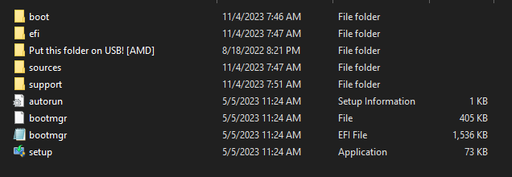

# RAID Reinstallation

## <mark style="color:purple;background-color:purple;">REQUIREMENTS:</mark>

1. A USB with 8GB of storage space (32GB Max)
2. A little bit of handiness, and a little knowledge about PCs

### THIS WAY OF REINSTALLING <mark style="color:green;">IS HIGHLY RECOMMENDED!</mark>


🌟 **Easiness**: <mark style="color:yellow;">**7/10 Doable, Not Hard**</mark>** |** 🕒 **15 Minutes Average Time.**


WHY IS THIS <mark style="color:green;"><strong>HIGHLY RECOMMENDED?</strong></mark>

The reason this reinstallation is recommended, especially for people with a lot of HWID bans on their PC, is because this reinstallation method changes your disk drive serials too. This is an important factor and almost **a 99% guaranteed successful spoof.**\
\
<mark style="color:red;background-color:red;">**Reminder: this is for AMD ONLY, Unless u know what ur doing on Intel.**</mark>

***

### <mark style="background-color:blue;">HOW TO REINSTALL & SPOOF SSD (BYPASS DISK BAN)</mark>



* Download Media Creation Tool above, click **"Download Now"**
* Open the **Media Creation Tool as an administrator**
* Select **Create Installation media (USB Flash drive)**
* Use all the recommended options & continue & wait for it to finish.

<figure><figcaption></figcaption></figure>

***

<mark style="color:green;">**\[1]**</mark> **AMD RAID FILES:** [<mark style="color:blue;">**DOWNLOAD RAID FILES**</mark>](https://shorturl.at/2Rhf1) <mark style="color:blue;background-color:blue;">**<- PUT FILES ON THE USB.**</mark>\
_MAKE SURE TO _ _<mark style="background-color:red;">**REMEMBER**</mark>  YOUR DISK SERIALS. **MAKE A PHOTO OF THEM ON YOUR PHONE.**_

### <mark style="background-color:green;">**YOUR USB SHOULD LOOK SIMILAR LIKE THIS SCREENSHOT:**</mark>

<figure><figcaption>
                                                                                                          
</figcaption></figure>


**NOTE:** When reinstalling Windows, most modern systems will automatically detect and install basic Ethernet drivers, so ur connection will work fine right after the installation. \
\
<mark style="color:red;background-color:red;">**However, in certain cases it might be needed to manually download and install network drivers:**</mark>\
\
Make sure to download your network drivers (LAN) from your corresponding motherboard model. So for example "Asus B550 Network drivers" on Google, and put them in the USB drive. You can skip this step since this is just a precaution, but there is a small risk of no connection after reinstallation.


***

<mark style="background-color:green;">\[</mark><mark style="background-color:green;">**2] ONCE COMPLETE AND USB MATCHES THE SCREENSHOT, RESTART PC AND BOOT INTO BIOS**</mark>\
_HOW TO <mark style="color:green;">EASILY</mark> BOOT INTO BIOS:_ [_**Video tutorial here.**_](https://youtu.be/mb9X9\_NNxuo?si)\
\
<mark style="background-color:green;">**\[3] DISABLE CSM, AND ENABLE "RAID" IN BIOS.**</mark>\
_Advanced > Integrated peripherals (or) Storage Configurations._\
_SATA Mode > "RAID" / NVME Mode > "RAID" **| **<mark style="color:red;">**SAVE & EXIT BIOS, GET BACK INTO BIOS AGAIN.**</mark>_\
\
<mark style="background-color:green;">**\[4] CONTINUE WITH THE REST OF THE RAID SETUP WITH THIS VIDEO GUIDE**</mark>\
[**https://streamable.com/9o2zci**](https://streamable.com/9o2zci) **<- video instructions for RAID setup.**

***

* **USE WINDOWS 10 PRO | **<mark style="color:red;background-color:red;">**MAKE AN OFFLINE ACCOUNT**</mark>

<figure><figcaption></figcaption></figure>

* Turn **OFF** All privacy questions/settings

<figure><figcaption></figcaption></figure>

***


**Make sure to follow these steps while and after reinstallation:**\
\
1\. Make an offline account or a new Microsoft account. Don't log in to the old ones.\
\
2\. Do not log in to <mark style="color:blue;">OneDrive, Logitech G Hub,</mark> or <mark style="color:green;">Geforce Experience.</mark>\
\
3\. Install: [https://aka.ms/vs/17/release/vc\_redist.x64.exe ](https://aka.ms/vs/17/release/vc\_redist.x64.exe)to prevent errors.


***

### WHEN YOU ARE ON <mark style="color:blue;">WINDOWS:</mark>

**\[5] **<mark style="background-color:green;">**CHECK OLD & NEW DISK SERIALS ON NEW WINDOWS**</mark>\
Now, use the disk-serialchecker.exe and see if the serials are changed, compare old vs new.

***
