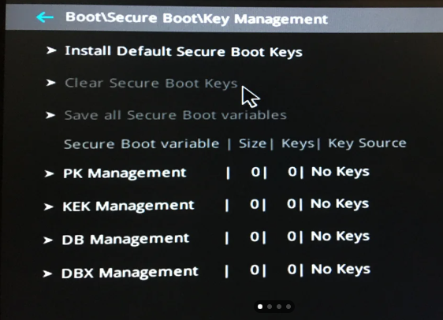

# Asus EFI Spoof

## THESE STEPS TAKE <mark style="color:blue;">5 MINUTES</mark> AT MOST.

1. Follow this video: [**https://streamable.com/k653am**](https://streamable.com/k653am)\
   <mark style="background-color:purple;">Download</mark> [<mark style="background-color:purple;">**Chrome Sound Booster**</mark>](https://chromewebstore.google.com/detail/volume-booster/ejkiikneibegknkgimmihdpcbcedgmpo) <mark style="background-color:purple;">if u can't hear the voice well 🔊</mark>&#x20;
2. Select **A/D/E/F** in Verse Loader, and run it! <mark style="background-color:red;">**No Files will be shown inside the drive. That's fine!**</mark>


**Please select the drive letter assigned to the partition.** So not all four, but the letter of the partition.


4. Open <mark style="color:blue;">**Powershell**</mark> as admin, write `[Guid]::newGuid()`and see the results.
5. **Make a picture of the GUID with ur phone**, we might need it later on (not always).
6. **Boot into BIOS** like u did before with TPM and [BIOS Configurations](../../../setup-instructions/bios-configurations.md#go-to-bios-and-follow-the-steps). (Restart + SHIFT)
7. Go to Boot > Secure Boot > OS Type **\[Windows]** & Secure Boot mode **\[Custom]**\
   Secure boot mode can be found under "**Boot configuration"** <mark style="background-color:red;">**(Don't have it? That's fine!)**</mark>
8. Ensure all Default keys are installed. If it shows **"0"** at all, click **"Install Default Keys".**

<figure><figcaption></figcaption></figure>

***

10. Now open **'KEK Management'** \
    \
    \- Choose "**Append key"** option.\
    \
    \- Press **"No"** to load it from a file on external media.\
    \
    \- Choose **USB** file system.\
    \
    \- Choose the "**vgk.der"** file.\
    \
    \- Select the file format as **"Public Key Certificate".**\
    \
    \- Enter the GUID (with hyphens) that you saved earlier then press enter. <mark style="color:red;background-color:red;">**NOT ALWAYS!**</mark>\
    \
    \- Finally, press "**Yes"** to append KEK with content from the .der file.

<mark style="color:green;background-color:green;">**YOU SHOULD NOW SEE A 'SUCCESS' MESSAGE IF YOU DONE EVERYTHING CORRECTLY!**</mark>

11. Do the same for '**DB Management'** as u did for KEK Management.
12. Now set up **(A/D/E/F)** Partition as **Boot priority #1** and **Windows Boot Manager as #2.**
13. Click save and exit bios again, we are done now. **You will boot EFI spoofed.**


**Note: This process is important for Asus users.** You would **ALWAYS** have to boot Windows from the A/D/E/F Partition. You cannot play Valorant without it. Sadly, there is no other way for this, other than buying a new non-Asus motherboard. **(TIP: Never buy Asus again. It's dogshit for spoofing**!)


### <mark style="color:red;background-color:red;">ONCE ON WINDOWS, DO THIS LAST VERY IMPORTANT STEP!!</mark> 💢💢

Download the **'cleanup.exe'** file, and run it as admin **(CMD will pop up for one second, that's it.)**



***
